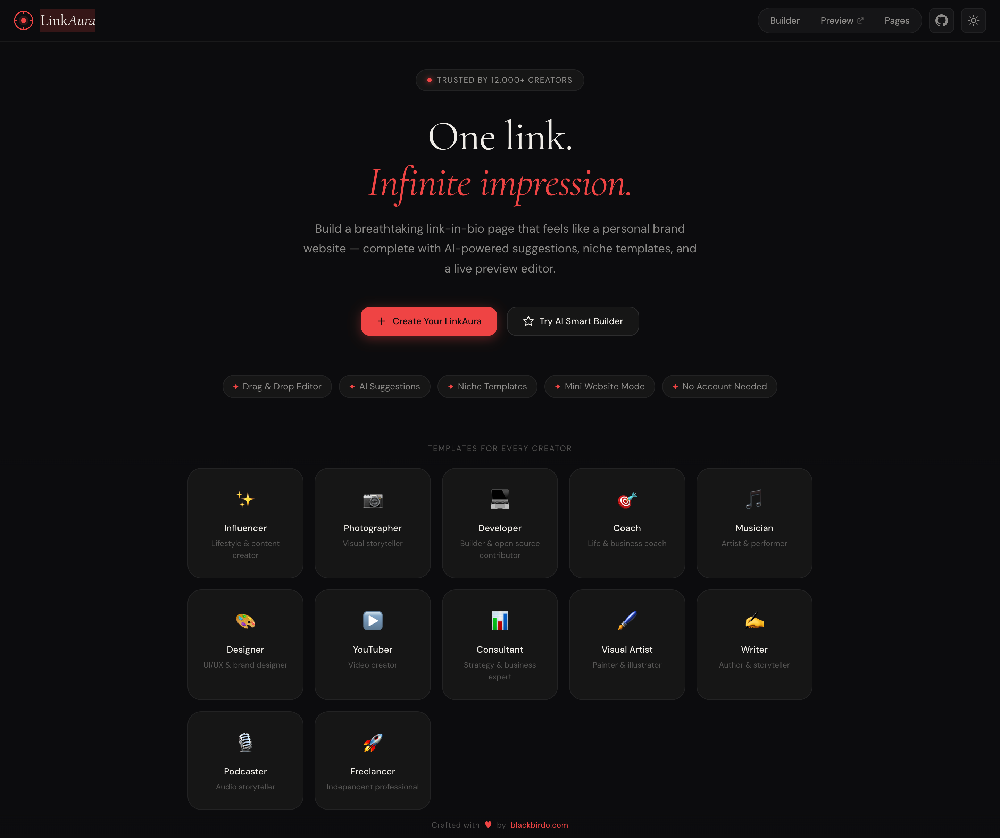
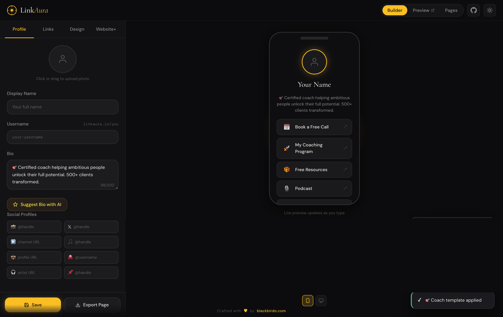

# ✦ LinkAura

> **Your Links, Elevated** — The most elegant and intelligent link-in-bio page builder.

## ✨ Preview




*Elegant link-in-bio pages with real-time preview and luxurious editor*


LinkAura is a **completely free, open-source, 100% client-side** link-in-bio builder that delivers a premium experience on par with paid tools like Linktree, Beacons, and Carrd — with intelligent AI-powered suggestions, luxury design aesthetics, a real-time live preview editor, and **real shareable public links** powered by JSONbin.

---

## ✨ Features

### Core
- **Drag & Drop Link Management** — Reorder links with smooth drag-and-drop interactions
- **Real-Time Live Preview** — Phone-frame preview updates instantly as you type
- **Profile Editor** — Upload avatar, set name, bio, username, and social profile handles
- **Auto-Save** — Pages saved automatically to localStorage every 30 seconds
- **Multiple Pages** — Create, edit, duplicate, and delete multiple LinkAura pages
- **Publish & Share** — One-click publish to a real public URL anyone can visit

### AI Smart Builder
- **AI Onboarding** — Enter your name, niche, and vibe → get a fully populated page
- **Bio Suggestions** — 3 contextual bio variations per niche
- **Smart Link Suggestions** — Relevant link recommendations based on your niche
- **Niche Auto-Detection** — Pattern-matches your text to 12 supported niches

### Niche Templates (12 included)
Influencer · Photographer · Developer · Coach · Musician · Designer · YouTuber · Consultant · Visual Artist · Writer · Podcaster · Freelancer

### Design & Customization
- **Dark / Light Mode** — Elegant toggle with smooth transitions
- **10 Accent Colors** — Curated palette + custom color picker
- **4 Background Styles** — Particles · Gradient · Mesh · Minimal
- **4 Link Card Styles** — Glass · Solid · Outline · Soft
- **3 Typography Options** — Editorial (Cormorant) · Modern (DM Sans) · Mono (DM Mono)
- **Animated Particle Canvas** — Ambient floating particles using accent colors

### Publish & Share System
- **Real public URLs** — Anyone can open your link with no account needed
- **QR Code** — Auto-generated QR code for every published page
- **Social Share buttons** — Twitter/X, WhatsApp, Instagram (copy for bio)
- **Export to HTML** — Download a standalone HTML file to host anywhere
- **Powered by JSONbin** — Free cloud storage, no backend required

### Mini Website Mode
- Toggle to expand your link page into a full personal website
- **About Section** — Longer story text
- **Gallery** — Upload up to 6 images in a beautiful grid
- **Contact Form** — Embedded contact form preview

---

## 🗂️ Project Structure

```
linkaura/
├── index.html              # Main app — editor, builder, pages manager
├── view.html               # Public viewer — renders any published page
├── css/
│   └── style.css           # All styles — CSS custom properties, dark/light theme
├── js/
│   ├── utils.js            # Shared helpers (DOM, storage, clipboard, color utils)
│   ├── theme-manager.js    # Dark/light toggle, accent colors, backgrounds, particles
│   ├── link-manager.js     # Link CRUD, drag & drop, social links, icon detection
│   ├── ai-suggestions.js   # Niche templates, bio generation, link suggestions
│   ├── publish.js          # Publish system — JSONbin upload, share modal, QR code
│   └── main.js             # App orchestrator — views, preview, pages, events
├── assets/
│   └── icons/              # Reserved for custom SVG icon assets
├── README.md
├── LICENSE
└── .gitignore
```

---

## 🚀 Getting Started

### Option 1: Open directly (no build step)
```bash
git clone https://github.com/ICodingStack/LinkAura.git
cd LinkAura
open index.html
```

Or just drag `index.html` into any browser — it works fully offline.

### Option 2: Serve locally
```bash
# Using Python
python3 -m http.server 3000

# Using Node.js
npx serve .

# Using VS Code
# Install "Live Server" extension → right-click index.html → Open with Live Server
```

> **Note:** The Publish feature requires an internet connection and a free JSONbin API key (see setup below). All other features — editing, saving, previewing, exporting — work fully offline without any key.

---

## 🔑 Setting Up the Publish Feature

The **Publish** button lets anyone share their page via a real public URL. It uses [JSONbin.io](https://jsonbin.io) — a free cloud storage API — to store page data. Setup takes under 2 minutes.

### Step 1 — Create a free JSONbin account

1. Go to **[https://jsonbin.io](https://jsonbin.io)** and click **Sign Up** (completely free)
2. After logging in, open the **API Keys** section in your dashboard
3. Copy your **Master Key** — it looks like this: `$2a$10$AbCdEfGhIjKl...`

### Step 2 — Add your API key to publish.js

Open `js/publish.js` and find **line 11**:

```js
// ⚠️  IMPORTANT: Replace this placeholder with your real JSONbin Master Key
// Get yours free at https://jsonbin.io → Sign Up → API Keys
const JSONBIN_API_KEY = '$2a$10$placeholder_replace_with_your_jsonbin_key';
```

Replace the placeholder value with your actual key:

```js
const JSONBIN_API_KEY = '$2a$10$YOUR_REAL_MASTER_KEY_HERE';
```

> ⚠️ **Keep your key private.** Do not commit it to a public GitHub repo. Consider using a `.env` file or environment variable if you add a build step later.

### Step 3 — Set your viewer base URL

Still in `js/publish.js`, find **line 14**:

```js
// ⚠️  IMPORTANT: Change this to your own deployed domain
// This is where view.html is hosted — must be publicly accessible
const VIEWER_BASE = 'https://icodingstack.github.io/LinkAura/view.html';
```

Replace it with your own deployed URL (see Deployment section below):

```js
// Example for GitHub Pages:
const VIEWER_BASE = 'https://ICodingStack.github.io/LinkAura/view.html';

// Example for Netlify:
const VIEWER_BASE = 'https://your-linkaura.netlify.app/view.html';
```

### ✅ Done!

Once both values are set, clicking **Publish** in the editor will:
1. Upload your page data to JSONbin (~5–10 KB of JSON)
2. Generate a unique public URL: `your-viewer-url/view.html?id=BINID`
3. Show the link, a QR code, and social share buttons in a modal

---

## 🌐 Deployment

LinkAura is a static site — deploy anywhere for free. Both `index.html` **and** `view.html` must be deployed in the same folder.

| Platform | How |
|----------|-----|
| **GitHub Pages** | Push repo → Settings → Pages → Source: `main` → root `/` |
| **Netlify** | Drag & drop the project folder at [netlify.com/drop](https://app.netlify.com/drop) |
| **Vercel** | Run `npx vercel` inside the project folder |
| **Cloudflare Pages** | Connect your repo at [pages.cloudflare.com](https://pages.cloudflare.com) |

### GitHub Pages — full walkthrough

```bash
# 1. Create a repo on GitHub (e.g. "linkaura")

# 2. Push your code
git init
git add .
git commit -m "Launch LinkAura"
git remote add origin https://github.com/ICodingStack/LinkAura.git
git push -u origin main

# 3. Enable GitHub Pages:
#    Repo → Settings → Pages → Source: Deploy from branch → main → / (root) → Save

# 4. Your site is live at:
#    https://ICodingStack.github.io/LinkAura/
```

After deploying, update `VIEWER_BASE` in `js/publish.js`:
```js
const VIEWER_BASE = 'https://ICodingStack.github.io/LinkAura/view.html';
```

---

## 🏗️ How the Publish System Works

```
User clicks "Publish" in the editor
            ↓
publish.js collects the full page data
(name, bio, links, accent color, font, theme…)
            ↓
Strips oversized images to stay under JSONbin's 100KB limit
            ↓
Uploads { page: { ...data } } to JSONbin via POST /v3/b
            ↓
JSONbin returns a unique Bin ID (e.g. "6634f2abc123456")
            ↓
Public URL is built:
https://your-site.com/view.html?id=6634f2abc123456
            ↓
view.html fetches the JSON from JSONbin
and builds the full page in the browser
            ↓
Anyone with the link sees a beautiful, live page ✦
No account, no login, no backend required.
```

### JSONbin Free Tier Limits

| Item | Limit |
|------|-------|
| Bins (pages) | Unlimited |
| Reads per bin / month | 10,000 |
| Max bin size | 100 KB |
| Auth required to read a public bin | No |
| Cost | Free |

---

## 🎨 Tech Stack

| Concern | Technology | Reason |
|---------|------------|--------|
| Styling | Tailwind CSS (CDN) + custom CSS | Utility classes + design tokens |
| JavaScript | Vanilla ES6+ | Zero dependencies, maximum performance |
| Fonts | Google Fonts (Cormorant Garamond, DM Sans, DM Mono) | Premium editorial aesthetic |
| Local Storage | localStorage | Offline-first, no backend |
| Animation | Canvas 2D API + CSS animations | Smooth particle system |
| Cloud Storage | JSONbin.io REST API | Free, no backend, instant JSON storage |
| QR Codes | qrcode.js (CDN, MIT) | Lightweight, no server needed |

---

## ⌨️ Keyboard Shortcuts

| Shortcut | Action |
|----------|--------|
| `Cmd / Ctrl + S` | Save current page |
| `Esc` | Close any open modal |
| `Enter` | Confirm inline link edits |

---

## 🧩 Extending LinkAura

### Add a new niche template
In `js/ai-suggestions.js`, add an entry to `NICHE_TEMPLATES`:
```javascript
{
  id: 'photographer',
  name: 'Photographer',
  emoji: '📷',
  desc: 'Visual storyteller',
  accent: '#94a3b8',
  bio: (name) => `📷 ${name} — capturing light & emotion worldwide.`,
  links: [
    { title: 'Portfolio', url: 'https://myportfolio.com', icon: '🖼️' },
  ],
}
```

### Add a new accent color
In `js/theme-manager.js`, add to `COLOR_PALETTE`:
```javascript
{ hex: '#your-hex', name: 'Your Color Name' }
```

### Add a new social platform
In `js/link-manager.js`, add to `SOCIAL_PLATFORMS`:
```javascript
{ key: 'threads', label: 'Threads', icon: '🧵', placeholder: '@handle' }
```

### Use a different storage backend
`js/publish.js` is self-contained. You can replace the `uploadToJsonbin` function to use any service — Supabase, Firebase, your own API:

```javascript
async function uploadToJsonbin(pageData) {
  const res = await fetch('https://your-api.com/pages', {
    method: 'POST',
    headers: { 'Content-Type': 'application/json' },
    body: JSON.stringify({ page: pageData }),
  });
  const { id } = await res.json();
  return id; // return the unique page ID
}
```

---

## ❓ FAQ

**Q: Does Publish work without an API key?**
A: No. You need a JSONbin Master Key to create bins. Reading public bins requires no key. Sign up free at [jsonbin.io](https://jsonbin.io).

**Q: Are published pages private?**
A: Pages are stored as **public bins** — anyone with the link can view them. JSONbin offers private bins on paid plans if you need restricted access.

**Q: What happens if a published link stops working?**
A: `view.html` shows a friendly "Page not found" message with a link to create a new page. You can re-publish at any time to get a fresh URL.

**Q: Can I use LinkAura without the Publish feature?**
A: Yes. Editing, saving, live preview, exporting to HTML, and all design tools work completely offline. Publish is optional.

**Q: What data gets stored in JSONbin?**
A: Only your page content — name, bio, links, colors, font choice, and theme. Large base64 avatar images are automatically excluded to keep the payload small (under 10 KB typically).

**Q: Is my API key safe?**
A: Your key is stored in `js/publish.js` and sent only to `api.jsonbin.io`. It is never logged or shared elsewhere. For extra security, avoid committing the key to a public repository — consider injecting it via a build step or environment variable if needed.

---

## 📄 License

MIT License — free for personal and commercial use. See [LICENSE](LICENSE).

---

## 🙏 Credits

Designed and built with love for creators everywhere.

- Typography: [Google Fonts](https://fonts.google.com)
- CSS utilities: [Tailwind CSS](https://tailwindcss.com)
- QR Code generation: [qrcode.js](https://github.com/soldair/node-qrcode)
- Cloud storage: [JSONbin.io](https://jsonbin.io)

---

**Made with ♥ by [BlackBirdo](https://blackbirdo.com)**

